

<h1>Data Analysis for HPC Service</h1>

<strong>Yiyue Cao & Yuxing Peng</strong>

# Background and Object 

 ⭕️ The ***Midway Computing Center*** provides the University of Chicago community a full-service ***high-performance computing (HPC)*** center, including visualization, software, workshops, consulting, and data-management strategies. 

 ⭕️ But in recent years, with the increased importance of computing resources and skyrocketed demand of them, there appears to be **underusage** and **misallocation**. 
 
 ⭕️ We use data from db.###.uchicago.edu to get yearly information of **Usage, Allocation, Available Resources and Users** to analyze the relationship among **Usage Portion, Allocation** and so on. Furthermore, we apply machine learning for the ***Classification*** of Users and ***Prediction*** of their future usages for future utilization of resources and optimal allocation.
  

# 2 Description of Data

Allocation and usage data were queried from MCC internal Account-Tool database (MySQL) hosted at ***db.###.uchicago.edu***, including multiple tables storing MCC accounts information. 

- **unit**: stores the unit name (such as PSD, BSE, IME, Booth ...) and its internal ID.
- **midway_account**: provides the account names, created dates and corresponding unit IDs.
- **midway_allocation**: proivdes the allocation records including cycle, account, cpu-hours and type of the allocations (Startup, Research I, Research II, Education, Special). Only records for Research I & II allocations are used for this report.
- **midway_usages**: stores all job records in current year-cycle. A record includes all job information dumped from the SLURM ***sacct*** command. Several important columns are (1) date-time (2) account (3) user (4) partition (5) ncpus (6) nnodes (7) charged SUs. Only jobs running on the "sandyb" and "broadwl" paritions are used for this report.
- **midway_usages_archived**: the same structure as the **midway_usages** table but stores all records in past year-cycles.

Allocation records are directly dumped from the database covering cycles 2013 to 2018. Usages are pre-processed for each cycle by following steps:

1. Check out all records from either **midway_usages** or **midway_usages_archived** table.
2. Aggregate records by group accounts and count the total number of jobs, charged SUs, distinct users, and calculate average cpus and nodes for jobs in each group.
3. For the 2018 cycle, the amounts have been projected to the full year of 365 days.

Finally we aggregated the results of all year-cycles together, so in the table each record (row) is the data for a group in a year.

The avaliable SUs were estimated from the history of system load. The data can be queried from MCC statistics sever ***stats.###.uchicago.edu***, and it hosts a time-series database (Graphite) that stores historical logs of allocated and idle nodes reported by SLURM. Data were pre-processed by aggregration to daily average before downloading. After downloading the daily data, we aggregated it by year-cycles. The data points for 2018 were projected to 365 days.

# 3 Analysis and Discussions

## 3.1 Total allocations and usages over years

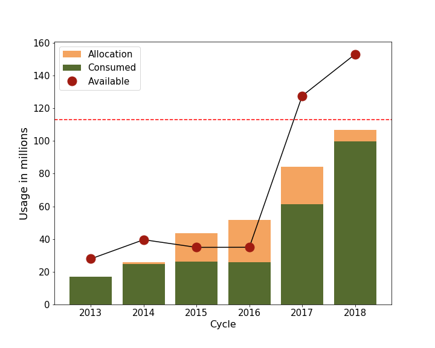

### Data

 - the yearly (by cycle) totals of **research allocations (I & II)**, consumed **service units usages** (SUs) and available SU **capacity** were calculated and shown above. 
 - The totals of allocations and SUs are from the ***Account-Tool*** MYSQL database, while the available capacity are calculated from the ***Graphite*** database. 
 - Note, as we are still in the **cycle 2018**, the  for 2018 is the projection accordig to the **current data** (from current days to 365 days).  For example, if the usages of 100M SUs on May 20, 2018, which counts for 232 days from Oct 1, 2017, the shown data will be projected to 365 days by 100M / 232 * 365 = 157.3M.
  

### Figure

   -  **Heights of orange bars**: the amounts of allocations
   -  **Heights of Green bars**: unused allocations (allocation minus usage).  Except for the cycle 2013 (testing phase), there have been unused allocations in every cycle. 
   -  Red points and **black lines**: available resources (capacity of the cluster) (A big increase from 2016 to 2017 is due to the deployment of the new system **Midway2**.)
   -  Dashed lines provide references of capacitis from **Midway1** (blue), **Midway2** (red) and **both** (green).
  

### Summary

 - In cycles 2015 and 2016, we granted oversubscribed allocations to improve the usage (loading) of the cluster. In 2016 and 2017, we've been allocated SUs less than the capacity combining **Midway1** and **Midway2** because the system **Midway1** is planned for decommission.
 - Through the comparison of yearly allocated cpu given to users, their usage and total available cpu, we witness an obvious declined usage portion with the increase of year. 
 - Additionally, the allocations are much lower than available resources in recent 2 years, indicating there is only not under-usage but also insufficient utilization of available resources.  
  
  
  

## 3.2 Allocations and usages by units

<table style="width:100%">
  <tr>
    <td>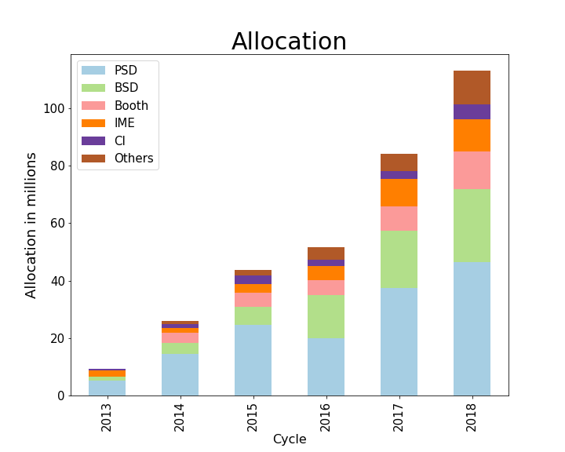</td>
    <td>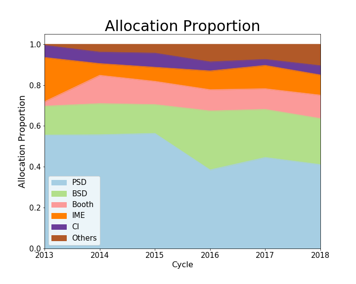</td>
  </tr>
  <tr>
    <td>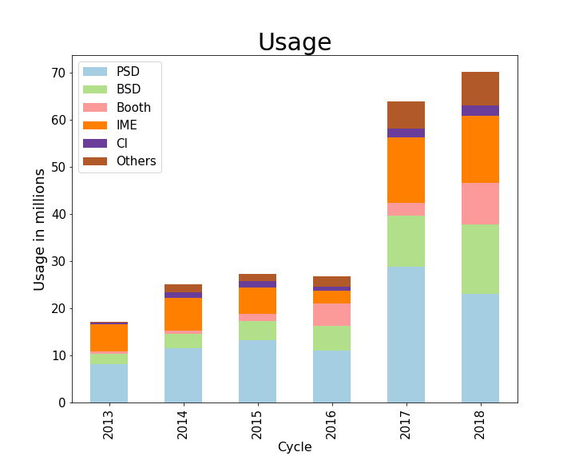</td>
    <td>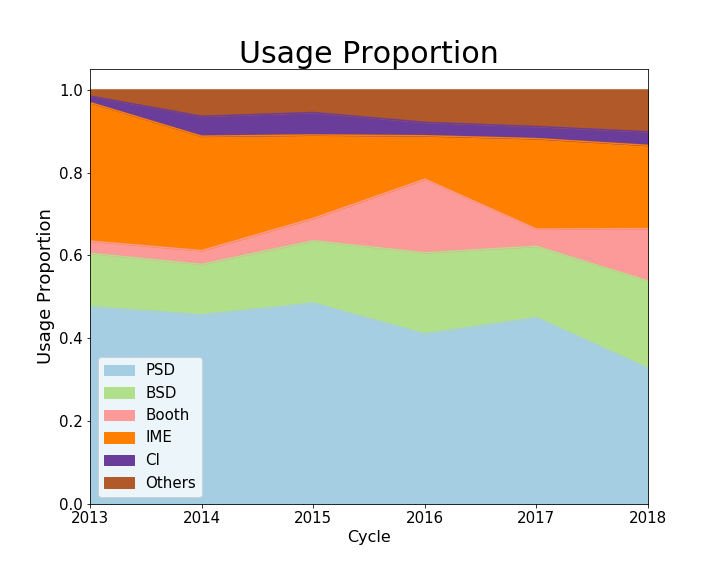</td>
  </tr>
</table>

### Data

Based total **service units usages**(usages), we get top 5 divisions: PSD, IME, BSD, Booth and CI
The acquirement of usages of divisions is by matching the **Unit ID** of accounts and corresponding Units(Divisions)

This section conducts **allocation** and **consumption** analysis based on the top 5 divisons.

**Biographies of Top 5 Divison:**

| Division | Full name | Field |
|:--------:|:--------------------------------------------------:|:--------------------------------------------------------------------------------------------------------------------------------------------:|
|  **PSD**| **Physical Science Division** | Astronomy, Chemistry, Computer Science, Statistics, Mathematics, Physics |
| **IME** | **Institute for Molecular Engineering** | Technology, Energy, Medicine, Environment, Quantum Research, Molecular Genetics|
| **BSD** | **Biological Sciences Division** | Biochemistry, Ecology, Genetics, Neurobiology, Public Health, Clinics |
| **Booth** | **Booth School of Business** | Accounting, Economics, Finance, Marketing, Management, Organizations|
| **CI** | **Computation Institute** | Bioinformatics, Neuroscience, Environment, Astrophysics, Computational economics|

### Figure

 - The results are summarized as the total amounts (first column, stacked bars) and fractions (second column, filled areas) of allocations (first row) and usage (second row) categorized by UC units. 
 - Six data sets are colored by units including the five units with the largest accumulated usages are explicited plotted, while the totals from other units are aggregated as "others". 

### Summary

 - **Overall**: Through the color distribution, divisions with larger consumption got larger allocation in average.
 - **Case Studies**: 
   - **PSD**: circumscribed veteran
     - PSD has historically accounted for the largest proportion of allocation and usages. However in **2016** it was encountered with sharp cutting down of allocation, and the released protion flowed to **BSD**. However, BSD didn't have correspondingly large usages that there was an early shape of **misallocation**. 
     - In **2017** and **2018**, PSD's allocation proportion wasn't recovered, the declining usage of PSD indicates its caution in consumption and potential failure of utilization.
   - **IME**: fettered rising star
     - As a relatively new institute established in 2011, its demand for computing resources climbed quickly.
     - Since 2013, its usage has generally shrunk with tightly restricted and insufficient allocation, and the same problem occurred to Booth since 2016. 
 - ***Rejection sensitivity***:
     Having experienced rejection to demanded allocation, divisions tended to be conserved in consumption. For scientific researches, this is not always a good trend. In the long term, without sufficient computing-resource enpowerment, researchers will get frustrated and researches will be effected.

 
 

## 3.3 VIP Groups

<table>
  <tr>
    <td>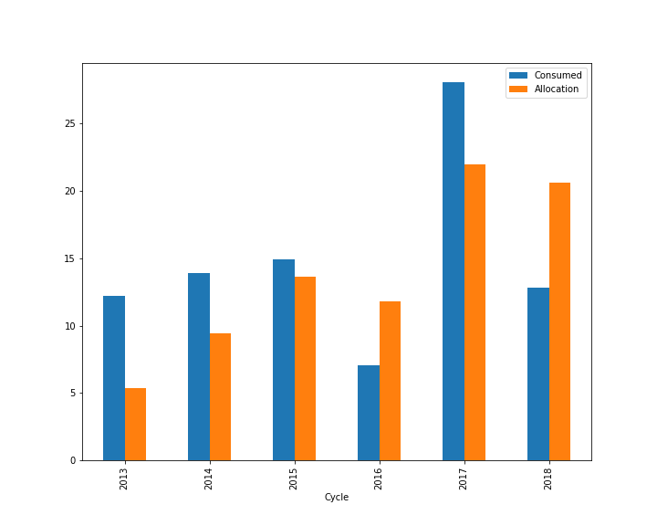</td>
    <td>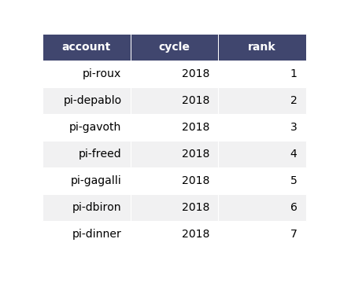</td>
  </tr>
</table>

### Data
Based total **service units usages**(usages), we get **top 10** groups(Account), referred to as **VIP Groups**
Then retriving the summation of their allocation and usage over years.

### Figure
The graph shows from 2013 - 2018, 10 vip groups as a whole have more consumption than their allocation.
### Summary
 - In every year, VIP groups as a whole are **underserved**: Even though they might have proposed for more resources, they didn't get enough.
 - This reflect a serious problem of **misallocation** especially for groups with large demand for resources.     
 

## 3.4 Relation between Usage and Allocation

  

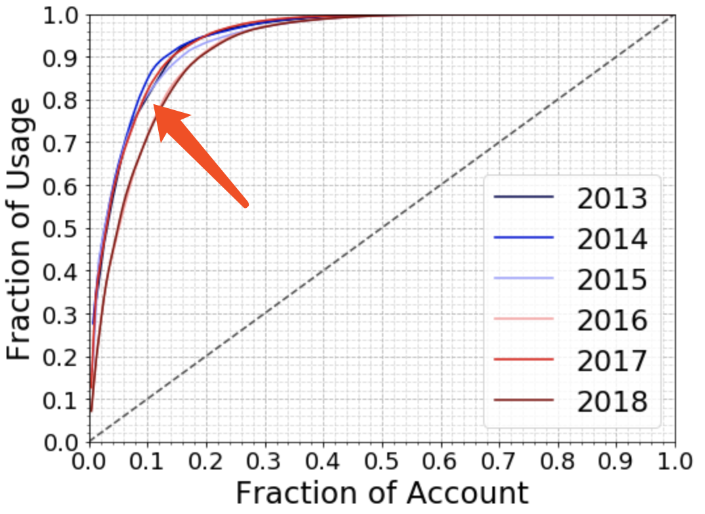

 ⭕️This graph shows the accumulated usage portions of all accounts.
  - The point reveals that **10% accounts** use **80% total available resources**, which is highly leveraged allocation. 
  - In 2017 and 2018, the issue seemed to be relieved. However, the graph below tells a different story:
  

 

 ⭕️In this graph, every point represents **one account**,the **Size**🌕represents group size, the **Color** indicates allocation volumn and the **Height** reflects its usage portion.     The red dotted line is the hypothetical usage portion based on past days of 2018.  
  - Averagely, larger groups have larger allocation and usage portions, which confirms our conjecture.
  - Half of the large groups reach the hypothetical usage portion, but most smaller groups did not do so.
  
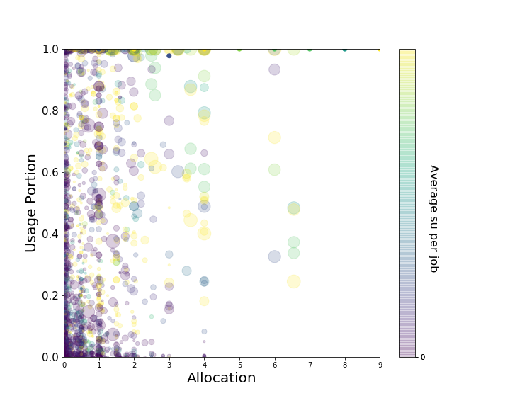
### Data
Historical data of usages and allocations categorized by cycle and groups.

### Summary
 - We should conduct fair redistribution based on data instead of hypotheses.
 - Larger groups indeed have averagely large usage portion and they are supposed to receive more allocation up on subscription.
   

## 3.5 Matrix Analysis

⭕️The pair-wise scatter plots are shown below for **Group Features** and **Useage Portion prediction**. 
  
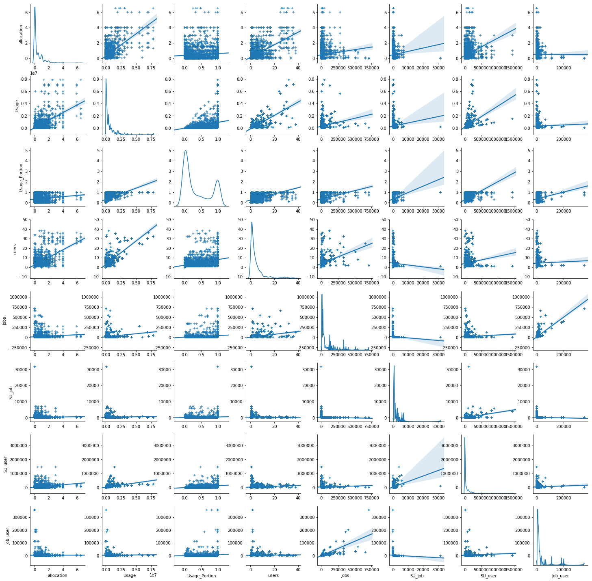

### Data
 - Here we regard groups with more than 4 million units of allocation as "VIP". "Jobs" are measured in every 3 million.

### Summary
 - All three Group Features (**Allocation, total Job and Group size**) are **strongly positively associated** with Use Portion
 - **Conclusion**: The three variables we selected are **good indicator** to assess the potential Useage Portion, and make judgement on their **future proposal** for resources.
 
 
## 3.6 Logistic Regression Analysis for Future Trend

We use **Groups' Features** to conduct **Useage Portion prediction**. The 8 features used here is 'Usage','Allocation','Usage_Portion_n',,'users','jobs','SU per job','SU per user','Jobs per user'. We ran a logistic regression on **next year's usage portion**.
  

### Summary
 - Six out of Eight group features reach **significant level**, indicating a strong correlation between them and the next year's usage portion, and they can be used as predicting factors.
  - In result testing, the **accuracy** of our model reaches **80.1%**. However, there is still room for improvement since in rawdata, the portion of "Under Usage" is more than 50%, the correctness for null hypothesis is not pretty high.
 - **Conclusion**: The six variables we selected are **good indicator** to assess the potential Useage Portion, among which **Users and Usage** shows significant precise in predicting future trend.
 
 
## 3.7 Logistic Regression Analysis for Usage Portion

### Relationship between Usage and Usage Portion
<table>
  <tr>
    <td>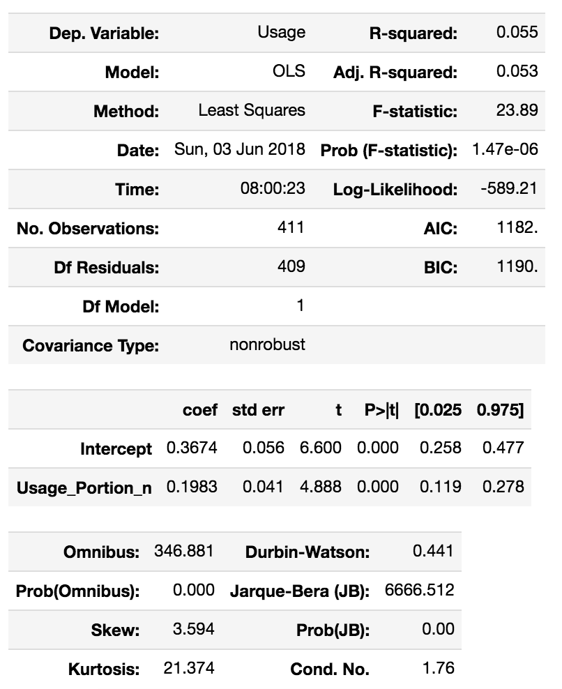</td>
    <td>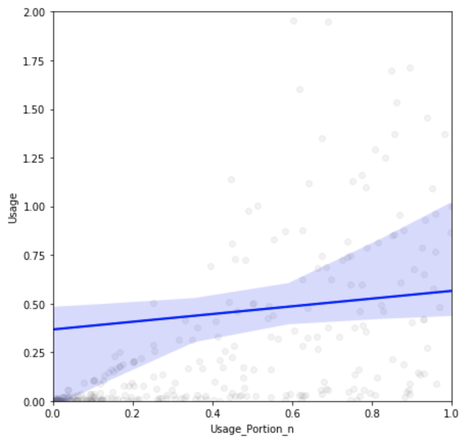</td>
  </tr>
</table>
### Summary
 - There is strong correlation between the uages and usage portion, from which we can conclude that larger group can utilize subscribed computing resources more efficiently. This confirms our proposal that larger groups (Vips) listed above are supposed to have large allocation of resources. 
 
### Relationship between Group Size and Usage Portion
<table>
  <tr>
    <td>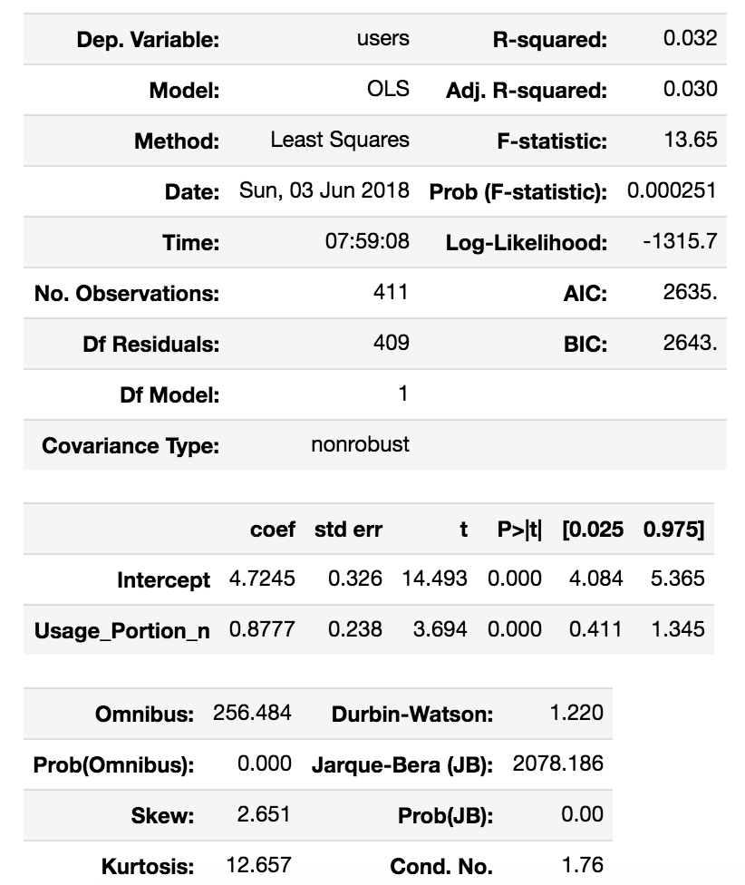</td>
    <td>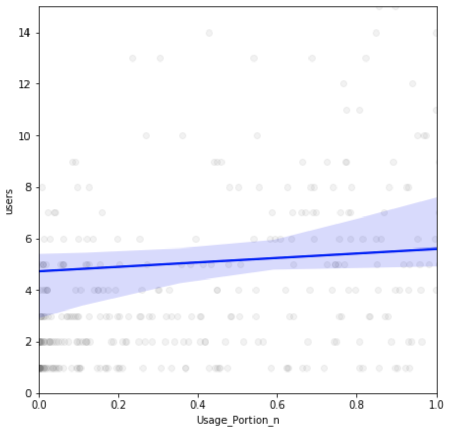</td>
  </tr>
</table>
### Summary
 - There is strong correlation between the group size and usage portion, from which we can conclude that larger group can utilize subscribed computing resources more efficiently. This confirms our proposal that larger groups (Vips) listed above are supposed to have large allocation of resources. 
 

# 4 Conclusions
In this project, we analyze the utilization of allocated computing resources and usage condition records from **Midway Computing Center** HPC. We assess the usage portion for different research groups given the **group futures** including 'Usage','Allocation','Usage_Portion_n',,'users','jobs','SU per job','SU per user','Jobs per user'. Then we combine the group features and usage portion indicators with the correspondingly **next year's usage portion**. The results were presented and explained.

From the data above, we  proved that the research groups with smaller size account for a large portion of groups stricken with **Under Usage** which spoilt the **utilization of resources** in M Computing Center. Moreover, given the restriction in resources allocation for large groups, we need consider another way to assess the allocation subscriptions for different groups. The methods we would recommend is to take **group futures** into consideration instead of simply sticking "equality and fairness". After all, based on economic principles, **equality is not efficiency**. To achieve social efficiency, we need to achieve the maximum summation of **Producer Surplus(PS)** and **Comsumer Surplus(CS)**, and minimize **Deadweight Loss(DWL)** that is generated by **quota and under usage**. 

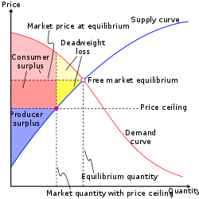

Overall, the indicators we chose are proved to play a significant role in the usage portion and can be considered as reasonable predictor for future usage portion. In future, M Computing Center should assess subscription of computing resources based on those indicators.
  

 - _For security reason, the name of the computing center is replaced by Midway computing center._
